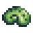
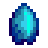
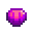

# Beach Forage Spawn

Beach (Spring)
Spawning Group: BeachSpawningGroup (0–2)

| Image                                    | Item         | Weight | Chance |
| ---------------------------------------- | ------------ | ------ | ------ |
|      | Blue Conch   | 3      | 23.08% |
|      | Sand Bucks   | 5      | 38.46% |
|  | Limpet Shell | 5      | 38.46% |

Beach (Summer)
Spawning Group: BeachSpawningGroup (0–2)

| Image                                        | Item           | Weight | Chance |
| -------------------------------------------- | -------------- | ------ | ------ |
|          | Blue Conch     | 3      | 25.00% |
|          | Sand Bucks     | 4      | 33.33% |
|      | Limpet Shell   | 3      | 25.00% |
|  | Winged Scallop | 3      | 25.00% |

Beach (Fall)
Spawning Group: BeachSpawningGroup (0–2)

| Image                                        | Item           | Weight | Chance |
| -------------------------------------------- | -------------- | ------ | ------ |
|          | Blue Conch     | 3      | 25.00% |
|          | Sand Bucks     | 4      | 33.33% |
|      | Limpet Shell   | 3      | 25.00% |
|  | Winged Scallop | 3      | 25.00% |

Beach (Winter)
Spawning Group: BeachSpawningGroup (0–2)

| Image                                    | Item         | Weight | Chance |
| ---------------------------------------- | ------------ | ------ | ------ |
|      | Blue Conch   | 2      | 28.57% |
|      | Sand Bucks   | 3      | 42.86% |
|  | Limpet Shell | 2      | 28.57% |

Beach (Rainy Days)
Spawning Group: BeachSpawningGroup_Rain (1–2)

| Image                                        | Item           | Weight | Chance |
| -------------------------------------------- | -------------- | ------ | ------ |
|  | Dotted Abalone | 1      | 100%   |

Beach Tide Pools (Spring)
Spawning Group: BeachTidePoolsSpawningGroup (0–2)

| Image                                        | Item           | Weight | Chance |
| -------------------------------------------- | -------------- | ------ | ------ |
|        | Coral Shell    | 1      | 33.33% |
|  | Crystal Cowrie | 2      | 66.67% |

Extra Coral
Spawning Group: CoralSpawningGroup (1–3)

| Image                     | Item  | Weight | Chance |
| ------------------------- | ----- | ------ | ------ |
|  | Coral | 1      | 100%   |

Beach Tide Pools (Summer)
Spawning Group: BeachTidePoolsSpawningGroup (0–2)

| Image                                  | Item        | Weight | Chance |
| -------------------------------------- | ----------- | ------ | ------ |
|  | Coral Shell | 1      | 100%   |

Beach Tide Pools (Fall)
Spawning Group: BeachTidePoolsSpawningGroup (0–2)

| Image                                  | Item        | Weight | Chance |
| -------------------------------------- | ----------- | ------ | ------ |
|  | Coral Shell | 1      | 33.33% |
|  | Red Trumpet | 2      | 66.67% |

Beach Tide Pools (Winter)
Spawning Group: BeachTidePoolsSpawningGroup (0–2)

| Image                                    | Item         | Weight | Chance |
| ---------------------------------------- | ------------ | ------ | ------ |
|    | Coral Shell  | 2      | 66.67% |
|  | Lucky Marine | 1      | 33.33% |

Ginger Island
Spawning Group: GingerIslandSpawningGroup (0–2)

| Image                                     | Item          | Weight | Chance |
| ----------------------------------------- | ------------- | ------ | ------ |
|       | Kitten Paw    | 2      | 16.67% |
|       | Sand Bucks    | 4      | 33.33% |
|  | Gem Sea Whelk | 4      | 33.33% |
|       | Blue Conch    | 2      | 16.67% |
|   | Spider Conch  | 2      | 16.67% |
