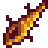
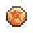
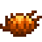
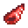
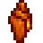
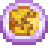

[Shell Collection](https://www.nexusmods.com/stardewvalley/mods/6690) adds various beach-themed items. Sea shells, crab pot fishes, new rarecrow collection, furniture, cookings, and more! All made to seamlessly blend to the game.

## Contents

* [Items](#items)
  * [Shells](#shells)
  * [Crab Pot Fishes](#crab-pot-fishes)
  * [Cookings](#cookings)
  * [Craftables](#craftables)
  * [Scarecrows](#scarecrows)
  * [Furnitures](#furnitures)
* [Events](#events)
* [Special Orders](#special-orders)
* [Quests](#quests)
* [Compatibility](#compatibility)
* [FAQ](#faq)

## Items

In version 2.0.0, this mod adds 10 shells, 2 crab pot fishes, 4 cookings, 3 craftables, 9 scarecrows, and 21 furnitures.

### Shells

Shells are beach forages in Beach Farm, Pelican Town's Beach, Ginger Island, and or other modded locations, see [compatibility](#compatibility). Rate of spawn can be seen in [Beach Forage Spawn](Documentation/BeachForageSpawn.md).

| Image | Shell | Base Price | Spawn | Notes |
| ----- | ----- | ---------- | ----- | ----- |
|  | [Blue Conch](Documentation/Objects/BlueConch.md) | 30g | All seasons, Ginger Island, Beach Farm | |
|  | [Coral Shell](Documentation/Objects/CoralShell.md) | 45g | Spring, Summer, Fall, Ginger Island | |
|  | [Crystal Cowrie](Documentation/Objects/CrystalCowrie.md) | 75g | Spring, Fall, Ginger Island | Only spawn on rainy day |
|  | [Kitten Paw](Documentation/Objects/KittenPaw.md) | 30g | Ginger Island | Only spawn on rainy day |
|  | [Lucky Marine](Documentation/Objects/LuckyMarine.md) | 100g | Winter, Beach Farm | |
|  | [Sand Bucks](Documentation/Objects/SandBucks.md) | 15g | All seasons, Ginger Island | |
|  | [Spider Conch](Documentation/Objects/SpiderConch.md) | 75g | All seasons, Ginger Island, Beach Farm | |
|  | [Red Trumpet](Documentation/Objects/RedTrumpet.md) | 20g | Fall, Winter, Ginger Island, Beach Farm | |
|  | [Gem Sea Whelk](Documentation/Objects/GemSeaWhelk.md) | 40g | Ginger Island | |
|  | [Limpet Shell](Documentation/Objects/LimpetShell.md) | 5g | All seasons, Ginger Island | |

### Crab Pot Fishes

Crab pot fishes added by this mod are saltwater fish. This means they can be caught in any crab pot placed in saltwater. Beside crab pot, they can also spawn as beach forages but at lower frequency compared to other [shells](#shells).

| Image | Fish | Base Price | Spawn |
| ----- | ---- | ---------- | ----------- |
|  | [Winged Scallop](Documentation/Objects/WingedScallop.md) | 30g | All seasons, Ginger Island |
|  | [Dotted Abalone](Documentation/Objects/DottedAbalone.md) | 30g | Spring, Fall, Winter, Ginger Island |

### Cookings

Cookings added by this mod make use of [Crab Pot Fishes](#crab_pot_fishes) as ingredients or acquired through barter using [Shells](#shells) added by this mod. When [SpaceCore](https://www.nexusmods.com/stardewvalley/mods/1348) is installed and 'Enable Flexible Recipes' config is set to true, some cooking recipes would accept wider range of items as ingredients.

| Image | Cooking | Base Price | Ingredients | Effect | Recipe Source |
| ----- | ------- | ---------- | ----------- | ------ | ------------- |
|  | [Crispy Abalone](Documentation/Cookings/CrispyAbalone.md) | 100g | Oil: 1   Dotted Abalone: 1 | Energy: +90   Health: +40.5 | 50% chance appearing in Saloon stock |
|  | [Braised Scallop](Documentation/Cookings/BraisedScallop.md) | 220g | Garlic: 1   Coconut: 1   Winged Scallop: 1 | Energy: +250   Health: +112.5 | Mailed after reaching 6 hearts with Evelyn |
|  | [Purple Plate](Documentation/Cookings/PurplePlate.md) | 370g | Amaranth: 1   Red Cabbage: 1   Winged Scallop: 1 | Energy: +275   Health: +123.75    Buff (7m)   Luck: +1   Max Stamina: +25 | 50% chance appearing in Saloon stock |
|  | [Mollusk Soup](Documentation/Cookings/MolluskSoup.md) | 175g | Mussel: 1   Dotted Abalone: 1   Winged Scallop: 1   Green Algae: 1 | Energy: +300   Health: +135    Buff (5m)   Luck: +2   Fishing: +2 |  50% chance appearing in Willy shop after seeing [Gift From Willy](Documentation/Events/GiftFromWilly.md) event |

### Craftables

| Image | Craftable | Base Price | Ingredients | Recipe Source |
| ----- | ---------- | ---------- | ----------- | ------------- |
|  | [Shell Necklace](Documentation/Objects/ShellNecklace.md) | 650g | Clam: 1   Rainbow Shell: 1   Crystal Cowrie: 1   Kitten Paw: 1   Blue Conch: 1 | [Gift From Willy](Documentation/Events/GiftFromWilly.md) event |
|  | [Sand Bucks Parcel](Documentation/Objects/SandBucksParcel.md) | 625g | Sand bucks: 5   Cloth: 1 | Purchase at Willy shop for 550g after receiving "Some More Stock" mail from Willy |

### Scarecrows

This mod adds [Nautical Scarecrow](Documentation/Scarecrows/NauticalScarecrow.md).

| Image | Craftable | Ingredients | Recipe Source |
| ----- | ---------- | ----------- | ------------- |
|  | [Shell Necklace](Documentation/Scarecrows/NauticalScarecrow.md) | Wood: 50   Coconut: 1   Fiber: 20 | [Gift From Willy](Documentation/Events/GiftFromWilly.md) event |

### Nautical Rarecrows

Nautical Rarecrow works the same way as regular Scarecrows. They can be obtained through purchase in various shops.

| Image | No | How to obtain |
| ----- | -- | ------------- |
|  | 1 | Purchase at Krobus shop for 5000g |
|  | 2 | Purchase at Desert Trader for 25 [Red Trumpet](Documentation/Objects/RedTrumpet.md) on odd days |
|  | 3 | Purchase at Travelling Merchant for 2000g with 25% chance appearing in Fall and Winter |
|  | 4 | Purchase at Desert Trader for 15 [Crystal Cowrie](Documentation/Objects/CrystalCowrie.md) on even days |
|  | 5 | Purchase at Travelling Merchant for 3500g with 25% chance appearing in Spring and Summer |
|  | 6 | Purchase at Casino for 12000 Qi Coins |
|  | 7 | Purchase at Island Trader for 20 Coral with 20% chance of appearing |
|  | 8 | Purchase at Willy shop for 3500g after fixing Willy boat |

### Furnitures

## Events

## Special Orders

## Quests

## Compatibility

This mod should be compatible with most other content pack mods.

Potential issues are:

* Event not playing properly due to edit in maps.
* d

Patches made for other mods:

* Character schedules and heart event patches when [East Scarp](https://www.nexusmods.com/stardewvalley/mods/5787) and [Stardew Valley Expanded](https://www.nexusmods.com/stardewvalley/mods/3753) is installed
* Conversation topic dialogues for some [East Scarp](https://www.nexusmods.com/stardewvalley/mods/5787) and [Stardew Valley Expanded](https://www.nexusmods.com/stardewvalley/mods/3753) characters (meaning the modded character would take note of occurrences introduced by this mod). These are mostly characters that I've encountered when playing the game. Feel free to post your suggestion for other modded characters.

## FAQ

1. Is it safe to add [Shell Collection](https://www.nexusmods.com/stardewvalley/mods/6690) mid-save?  
It is! The additional content added by this mod will work just fine.
2. How do I get this item?  
The items are designed to be encountered naturally as the game carry on. If you're really curious you can read the item documentation.
3. Is this mod is compatible with that mod?  
I don't really know. You are free to try, and if you'd like you can report the finding. It will surely be helpful to others.