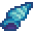
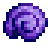
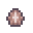
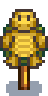
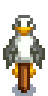
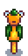
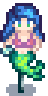
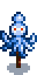
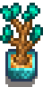
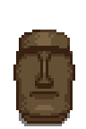

# Shells Collectiom

[Shells Collection](https://www.nexusmods.com/stardewvalley/mods/6690) adds various beach-themed items. Sea shells, crab pot fishes, new rarecrow collection, furniture, cookings, and more! All made to seamlessly blend to the game.

## Contents

* [Items](#items)
  * [Shells](#shells)
  * [Crab Pot Fishes](#crab-pot-fishes)
  * [Cookings](#cookings)
  * [Craftables](#craftables)
  * [Scarecrows](#scarecrows)
  * [Furnitures](#furnitures)
* [Events](#events)
* [Special Orders](#special-orders)
* [Shop Listings](#shop-listings)
* [Compatibility](#compatibility)
* [FAQ](#faq)

## Items

In version 2.0.0, this mod adds 10 shells, 2 crab pot fishes, 4 cookings, 3 craftables, 17 scarecrows, and 10 furnitures. Some NPCs gift tastes are modified with the items added, for details refer to [Gift Taste](Documentation/GiftTaste.md).

### Shells

Shells are beach forages in Pelican Town's Beach, Ginger Island, and or other modded locations. The spawn can be seen in [Beach Forage Spawn](Documentation/BeachForageSpawn.md).

| Image | Shell | Base Price | 
| ----- | ----- | ---------- | 
|  | Blue Conch | 30g |
|  | Coral Shell | 45g |
|  | Crystal Cowrie | 75g |
|  | Kitten Paw | 30g |
|  | Lucky Marine | 100g |
|  | Sand Bucks | 15g |
|  | Spider Conch | 75g |
|  | Red Trumpet | 20g |
|  | Gem Sea Whelk | 40g |
|  | Limpet Shell | 5g |

### Crab Pot Fishes

Crab pot fishes added by this mod are saltwater fish. This means they can be caught in any crab pot placed in saltwater. Beside crab pot, they can also spawn as beach forages like [shells](#shells).

| Image | Fish | Base Price |
| ----- | ---- | ---------- |
|  | Winged Scallop | 30g |
|  | Dotted Abalone | 30g |

### Cookings

Cookings added by this mod make use of [Crab Pot Fishes](#crab_pot_fishes) as ingredients. When [SpaceCore](https://www.nexusmods.com/stardewvalley/mods/1348) is installed and 'Flexible Recipes' config is set to true, some cooking recipes would accept wider type of items as ingredients based on assigned context tags, for example scallop and abalone added by other mods as long they set up the context tags.

| Image | Cooking | Base Price | Ingredients | Effect | Recipe Source |
| ----- | ------- | ---------- | ----------- | ------ | ------------- |
|  | Crispy Abalone | 100g | Oil: 1   Dotted Abalone: 1 | Energy: +90   Health: +40.5 | 50% chance appearing in Saloon stock |
|  | Braised Scallop | 220g | Garlic: 1   Coconut: 1   Winged Scallop: 1 | Energy: +250   Health: +112.5 | Mailed after reaching 6 hearts with Evelyn |
|  | Purple Plate | 370g | Amaranth: 1   Red Cabbage: 1   Winged Scallop: 1 | Energy: +275   Health: +123.75    Buff (7m)   Luck: +1   Max Stamina: +25 | 50% chance appearing in Saloon stock |
|  | Mollusk Soup | 175g | Mussel: 1   Dotted Abalone: 1   Winged Scallop: 1   Green Algae: 1 | Energy: +300   Health: +135    Buff (5m)   Luck: +2   Fishing: +2 |  50% chance appearing in Willy shop after seeing Gift From Willy event |

### Craftables

This mod adds three craftables to the game.

| Image | Craftable | Base Price | Ingredients | Recipe Source |
| ----- | ---------- | ---------- | ----------- | ------------- |
|  | Shells Necklace | 650g | Clam: 1   Rainbow Shell: 1   Crystal Cowrie: 1   Kitten Paw: 1   Blue Conch: 1 | Gift From Willy event |
|  | Sand Bucks Parcel | 625g | Sand bucks: 5   Cloth: 1 | Purchase at Willy shop for 550g after receiving "Some More Stock" mail from Willy |
|  | Coral Fence | 625g | Sand bucks: 5   Cloth: 1 | Purchase at Willy shop for 550g after receiving "Some More Stock" mail from Willy |

### Scarecrows

This mod adds Nautical Scarecrow and two lines of Rarecrows.

| Image | Craftable | Ingredients | Recipe Source |
| ----- | ---------- | ----------- | ------------- |
|  | Nautical Scarecrow | Wood: 50   Coconut: 1   Fiber: 20 | "Gift From Willy" event |

### Rarecrows

Nautical Rarecrow works the same way as regular Scarecrows. They can be obtained through purchase in various shops.
By default the Isles Rarecrow would only start appearing in shop after completing Nautical Rarecrow collection. However, there's config to change that so it available from the start.

*Nautical Rarecrows*

| Image | Rarecrow | Shop | Price | Condition |
| ----- | -------- | ---- | ----- | --------- |
|  | Nautical Rarecrow #1 | Krobus' Shop | 5000g | - |
|  | Nautical Rarecrow #2 | Desert Trader | 25x Red Trumpet | Mon/Wed/Fri/Sun |
|  | Nautical Rarecrow #3 | Travelling Merchant | 2000g | 50% chance during Fall or Winter |
|  | Nautical Rarecrow #4 | Desert Trader | 15x Crystal Cowrie | Tue/Thu/Sat |
|  | Nautical Rarecrow #5 | Travelling Merchant | 3500g | 50% chance during Spring or Summer |
|  | Nautical Rarecrow #6 | Casino | 12000 Qi coins | Willy boat has been fixed |
|  | Nautical Rarecrow #7 | Island Trader | 20x Coral | 20% chance to appear |
|  | Nautical Rarecrow #8 | Willy's Shop | 3500g | Willy boat has been fixed |

*Isles Rarecrows*

| Image | Rarecrow | Shop | Price | Condition |
| ----- | -------- | ---- | ----- | --------- |
|  | Isles Rarecrow #1 | Island Trader | 5x Dotted Abalone | Isles Rarecrow in-stock and 20% chance |
|  | Isles Rarecrow #2 | Desert Trader | 5x Lucky Marine | Isles Rarecrow in-stock and Mon/Wed/Fri/Sun |
|  | Isles Rarecrow #3 | Sandy's Shop | 5000g | Isles Rarecrow in-stock |
|  | Isles Rarecrow #4 | Willy's Shop | 3x Sand Bucks Parcel | Isles Rarecrow in-stock |
|  | Isles Rarecrow #5 | Casino | 12000 Qi coins | Isles Rarecrow in-stock and Willy boat has been fixed |
|  | Isles Rarecrow #6 | Raccoon's Shop | 20x Blue Conch | Isles Rarecrow in-stock |
|  | Isles Rarecrow #7 | Saloon | 5000g | Isles Rarecrow in-stock |
|  | Isles Rarecrow #8 | Desert Trader | 40x Spider Conch | Isles Rarecrow in-stock and Tue/Thu/Sat |

### Furnitures

This mod adds 10 furnitures purchaseable from various shops.

| Image | Furniture | Shop | Price |
| :---: | --------- | ---- | ----- |
|  | Shell Tree #1 | Desert Trader | 10 Blue Conch |
|  | Shell Tree #2 | Desert Trader | 15 Dotted Abalon |
|  | Urchin Vase | Desert Trader | 30 Limpet Shell |
|  | Coral Sculpture | Desert Trader | 20 Gem Sea Whelk |
|  | Stoic Face | Casino | 7000 Qi Coins |
|  | Sunset Drape | Casino | 2000 Qi Coins |
|  | Night Drape | Casino | 2000 Qi Coins |
|  | Mermaid Statue | Casino | 15000 Qi Coins |
|  | Goddess Statue | Casino | 15000 Qi Coins |
|  | Hanging Clam | Island's Trader | 10 Lucky Marine |

## Events

This mod adds two events.

### Gift From Willy

* Location: Willy's Fish Shop
* Time is between 06.00-17.00
* Has at least 6 Hearts with Willy

### Coral Order Completed

* Location: Carpenter Shop
* Time is between 06.00-17.00
* Has completed Coral Order special order

## Special Orders

This mod adds a single special order from Demetries that requires 15 corals. Check the tide pools, the coral spawn is buffed when the special order is active.

## Shop Listings

Some new barter is added to the mods. For the full list refer to [Shop Listings](Documentation/ShopListings.md)

## Compatibility

This mod should be compatible with most other content pack mods. Potential issues are:

* Event not playing properly due to edit in maps (Unlikely though).
* Multiple item with same name.

Patches made for other mods:

* Gift tastes for [Stardew Valley Expanded](https://www.nexusmods.com/stardewvalley/mods/3753) NPCs

## FAQ

1. Is it safe to add [Shells Collection](https://www.nexusmods.com/stardewvalley/mods/6690) mid-save?  
It is! The additional content added by this mod will work just fine.
2. How do I get this item?  
The items are designed to be encountered naturally as the game carry on. If you're really curious you can read the item documentation.
3. Is this mod is compatible with that mod?  
I don't really know. You are free to try, and if you'd like you can report the finding. It will surely be helpful to others.
